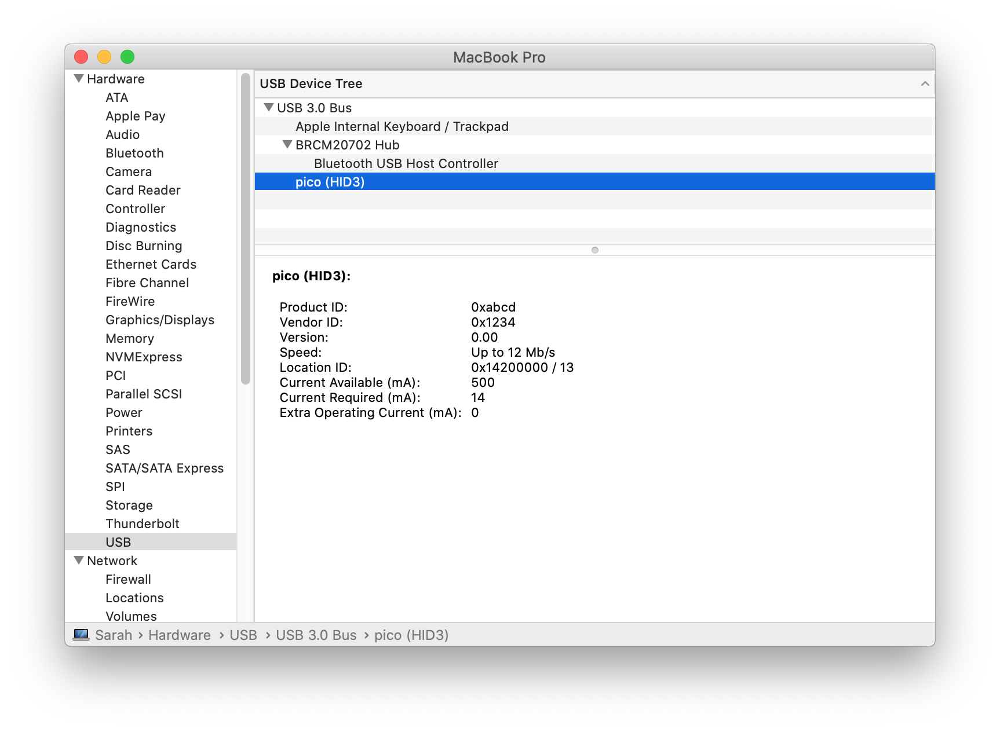

# pico-usb-hid

[ラズピコでTinyUSBやってみよう(3) - USB HIDの実装と動作](http://blueeyes.sakura.ne.jp/2021/03/08/3800/)

ホストから送られたデータに1を足したものを返送するデバイス

# build
```
cd pico-usb-hid
cp $PICO_SDK_PATH/external/pico_sdk_import.cmake .
mkdir build
cd $_
cmake ..
make -j4
```

# flash into pi-pico 
```
openocd -f interface/picoprobe.cfg -f target/rp2040.cfg -c "program pico-usb-hid.elf verify reset exit"
```

or just use [picoprog.sh](https://gist.github.com/hidsh/4dc19284ddea311825950b2a1be621bc)

# host program

- source: hid-test.c
- compile: `./hid-test-compile.sh`

## execute
```
./hid-test 200
Data sent. Return Code: 2
Data Read: 201

./hid-test -1
Data sent. Return Code: 2
Data Read: 0
```

## system iformation

