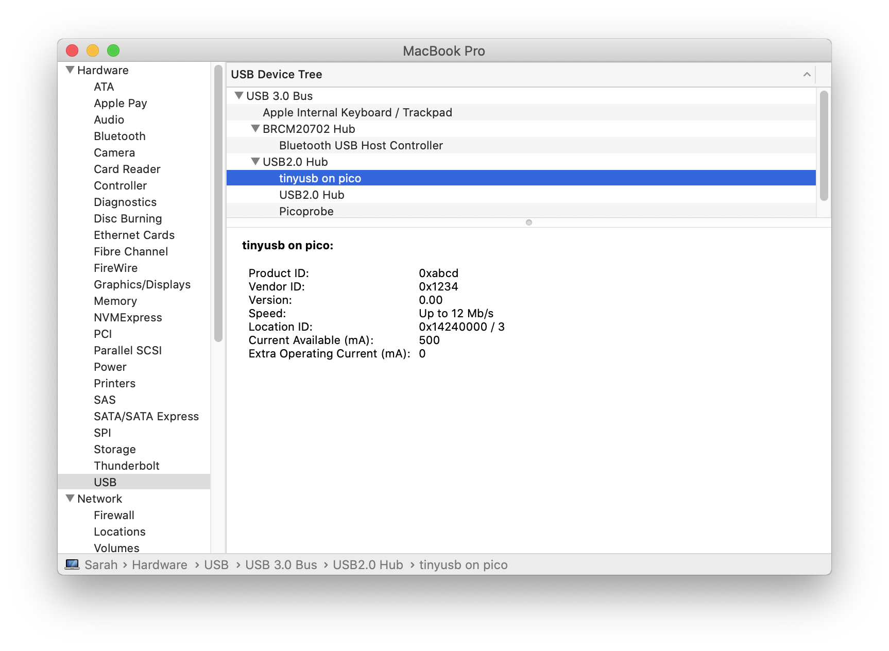

# pico-usb-null

[ラズピコでTinyUSBやってみよう(1) - 取り敢えず作ってみる](http://blueeyes.sakura.ne.jp/2021/02/13/3777/)

# build
```
cd pico-usb-null
cp $PICO_SDK_PATH/external/pico_sdk_import.cmake .
mkdir build
cd $_
cmake ..
make -j4
```

# flash into pi-pico 
```

openocd -f interface/picoprobe.cfg -f target/rp2040.cfg -c "program pico-usb-null.elf verify reset exit"
```

or just use [picoprog.sh](https://gist.github.com/hidsh/4dc19284ddea311825950b2a1be621bc)

# system information on mac


